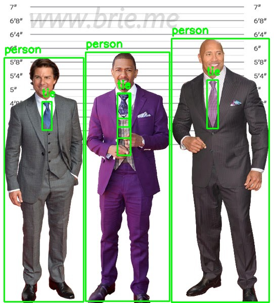
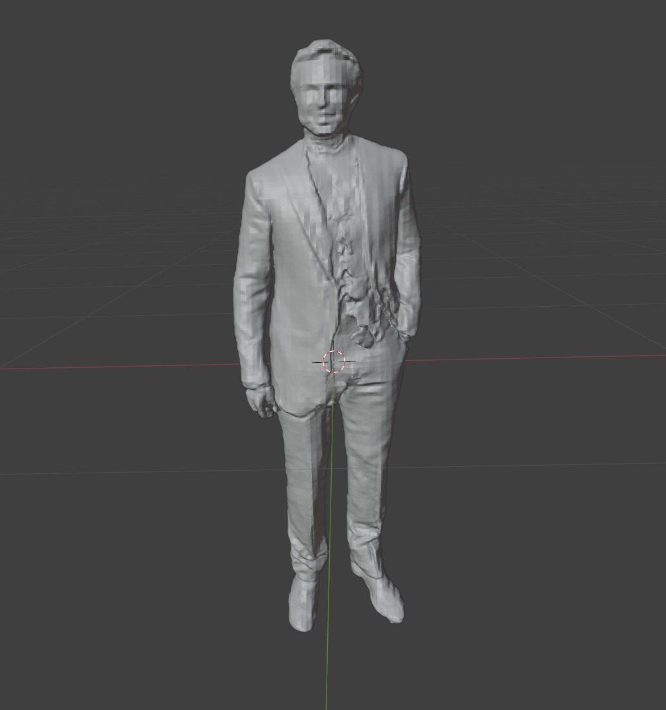

# 3D Human Mesh Generator from Single Image

This project is a pipeline that detects a person in an image, segments them precisely, and reconstructs a 3D mesh from the cropped region. It integrates **YOLO**, **SAM**, **OpenPose**, and **PIFuHD** to generate high-fidelity 3D models from 2D images.

---

## 🔧 Pipeline Steps

1. **Detection & Masking**
   - Run `main.py`
   - Executes YOLO for detection
   - Applies SAM for precise segmentation
   - Uses OpenPose for keypoint detection
   - You will be prompted to save the cropped image → Save it to:
     ```
     pifuhd/openpose/example/media/
     ```

2. **3D Mesh Reconstruction**
   - Navigate to `pifuhd/`
   - Run:
     ```
     python -m apps.simple_test
     ```
   - This generates the 3D mesh output using PIFuHD.

---

## 🧠 Models Used

- **Yolov11** – Person detection from full image.
- **SAM (Segment Anything Model)** – Precise mask of detected person.
- **OpenPose** – Extracts pose landmarks to improve mesh accuracy.
- **PIFuHD** – Reconstructs 3D mesh from masked image input.

---

## 📦 Folder Structure

```
.
├── main.py                # Orchestrates YOLO → SAM → OpenPose
├── /pifuhd
│   ├── /openpose/example/media/  # Save masked crop here
│   └── apps/simple_test.py       # Run this for 3D mesh output
```

---

## 📷 Example Outputs

| Stage | Output |
|-------|--------|
| **1. YOLO Detection** |  |
| **2. SAM Masking** |  |
| **3. 3D Mesh (PIFuHD)** |  |

---

## ⚠️ Limitation

- Requires the user to manually save the cropped masked image at the specific location before mesh reconstruction.

---

## 🙌 Acknowledgements

This project integrates and builds upon the following repositories:

- 🔗 Ultralytics: [https://github.com/ultralytics/ultralytics](https://github.com/ultralytics/ultralytics)
- 🔗 SAM (Segment Anything): [https://github.com/facebookresearch/segment-anything](https://github.com/facebookresearch/segment-anything)
- 🔗 PIFuHD: [https://github.com/facebookresearch/pifuhd](https://github.com/facebookresearch/pifuhd)

---

## 🏁 Getting Started

```bash
# 1. Clone all required repos
git clone https://github.com/Faykar78/AI_powered_3d_model_generator.git
cd your-repo

# 2. Setup environments for each dependency (YOLO, SAM, OpenPose, PIFuHD)

# 3. Start detection pipeline
python main.py

# 4. Save cropped output manually as instructed

# 5. Run mesh generation
cd pifuhd
python -m apps.simple_test
```
